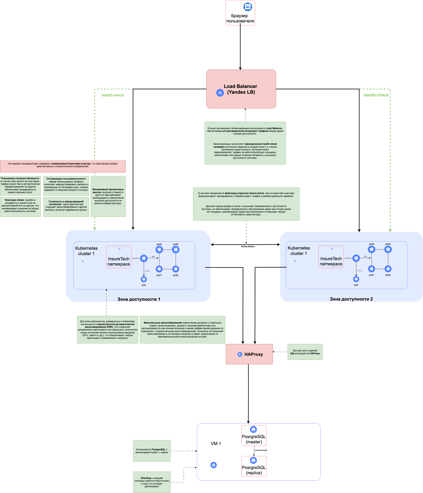

# Задание 1. Архитектурная стратегия масштабирования и отказоустойчивости

## Стратегия масштабирования

В качестве основной стратегии масштабирования выбрано **горизонтальное автоматическое масштабирование (Horizontal Pod Autoscaler, HPA)**.  
Каждый микросервис, развернутый в Kubernetes, масштабируется автоматически на основе метрик нагрузки (CPU, память, RPS, пользовательские метрики Prometheus).

Это позволяет системе **гибко реагировать на пиковые нагрузки**, поддерживать стабильную производительность и избегать перерасхода ресурсов.

---

## Повышение отказоустойчивости

Для обеспечения высокой доступности приложение развёрнуто **в двух зонах доступности (Availability Zones)**.  
Каждая зона содержит **независимый Kubernetes-кластер**, способный обрабатывать трафик автономно.  

Такой подход:
- обеспечивает **изоляцию отказов**;
- минимизирует **сетевые риски и задержки** между зонами;
- повышает **общую надёжность системы** по сравнению с растянутым кластером.

---

## Балансировка нагрузки

На внешнем уровне используется **интеллектуальный Load Balancer**, который:

- равномерно распределяет трафик между зонами;
- выполняет регулярные **health-check** кластеров;
- при недоступности одной зоны — **автоматически направляет весь трафик во вторую** (фейловер).

Это обеспечивает **бесшовное обслуживание клиентов**, даже при сбоях на уровне инфраструктуры.

---

## Фейловер-стратегия

Фейловер реализован **на трёх уровнях**:

1. **Внешний уровень (Load Balancer)**  
   Автоматическое переключение трафика между зонами на основе результатов health-check.

2. **Уровень приложений (Kubernetes)**  
   Автоматический перезапуск подов при сбоях и сбалансированное перераспределение нагрузки.

3. **Уровень базы данных**  
   Используется **репликация** PostgreSQL. При отказе мастера — **переключение на реплику** для обеспечения непрерывности работы.

---

## Конфигурация базы данных

- Используется PostgreSQL с **репликацией**.
- Основной узел (master) обрабатывает запись.
- Реплики обслуживают **читающие операции** (read-only).
- Это повышает отказоустойчивость и **разгружает основной узел**.

---

## Шардирование базы данных

- На текущем этапе **шардирование не применяется**.
- Репликация обеспечивает достаточную производительность и отказоустойчивость.
- Архитектура **предусматривает возможность внедрения шардинга в будущем**, при росте объёма данных или клиентской базы.

---

## Схема архитектуры

Схема наглядно демонстрирует:
- Распределение компонентов по зонам доступности
- Организацию отказоустойчивости на разных уровнях
- Взаимодействие между ключевыми элементами системы

