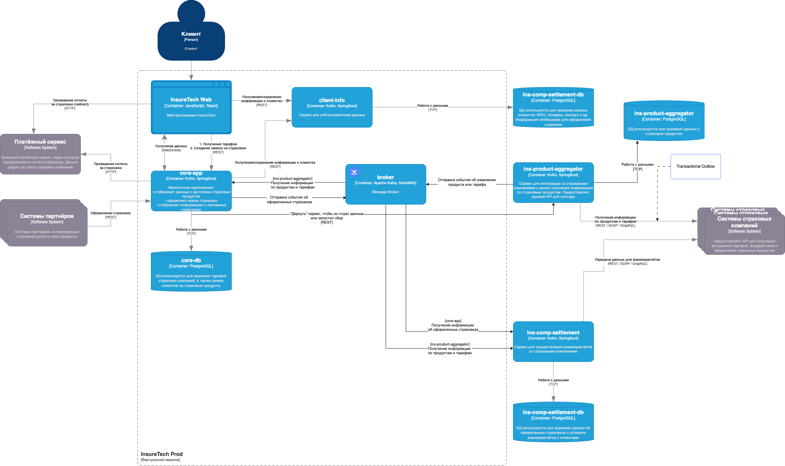
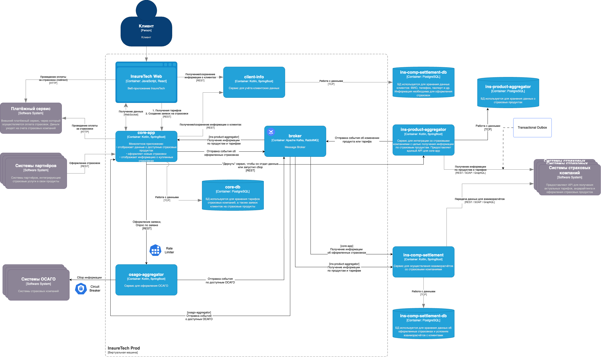

# Задание 3: Переход на Event-Driven архитектуру

## 3.1. Анализ текущей архитектуры

Текущая архитектура взаимодействия между сервисами построена на синхронных REST-запросах. При текущем числе партнёров это уже приводит к различным сбоям и задержкам. С ростом числа страховых компаний (ожидается подключение ещё пяти) существующая модель становится нежизнеспособной.

### Проблемы и риски

**1. Синхронная модель взаимодействия**  
Сервисы `core-app` и `ins-comp-settlement` взаимодействуют с `ins-product-aggregator` по REST, ожидая немедленного ответа. `ins-product-aggregator` в свою очередь синхронно обращается к API страховых компаний. Это создаёт длинную цепочку зависимостей, в которой задержка или ошибка на любом этапе приводит к сбою всего запроса.

**2. Сильная связность компонентов**  
Сервисы тесно связаны между собой: изменения или недоступность одного компонента немедленно влияют на работоспособность других. Такая архитектура неустойчива к сбоям.

**3. Использование short polling**  
`core-app` обращается к агрегатору каждые 15 минут, `ins-comp-settlement` — раз в сутки. Такой подход:
- Не гарантирует актуальность данных;
- Приводит к "пустым" (холостым) запросам;
- Создаёт дополнительную нагрузку на систему.

**4. Поддержка локальных реплик и возможная рассинхронизация**  
Каждый сервис хранит собственную копию данных о продуктах. Это порождает риски консистентности между `core-app` и `ins-comp-settlement`.

**5. Плохая масштабируемость**  
С увеличением числа страховых компаний пропорционально увеличивается время ответа и вероятность таймаутов. Это ведёт к нарушению SLA и снижению надёжности системы.

---

## 3.2. Предлагаемое решение: переход к событийно-ориентированной архитектуре

Для устранения текущих проблем предлагается перейти на **Event-Driven архитектуру**, сохранив при этом текущую декомпозицию сервисов.

### Ключевые изменения

#### 1. Замена short polling на событийную модель
- `core-app` и `ins-comp-settlement` больше не инициируют периодические REST-запросы к `ins-product-aggregator`.
- Вместо этого они **подписываются на события** обновления данных о продуктах через брокер сообщений (например, Kafka или RabbitMQ).
- Актуальные данные поступают сразу по мере появления, что повышает отзывчивость и снижает нагрузку.

#### 2. Использование Transactional Outbox
- В `ins-product-aggregator` внедряется **паттерн Transactional Outbox** для взаимодействия с внешними API страховых компаний:
  - В рамках одной транзакции данные сохраняются в БД и записываются в Outbox-таблицу.
  - Асинхронный процесс читает события из Outbox и публикует их в брокер.
- Это гарантирует **надежную доставку и консистентность данных**, устраняя рассинхронизацию между хранилищем и сообщениями.

#### 3. Асинхронный сбор данных от страховых компаний
- `ins-product-aggregator` выполняет асинхронный сбор информации от страховых компаний и публикует результат в виде событий.
- `core-app` теперь может инициировать сбор (по API) и ожидать результата в формате событий.
- Дополнительно возможно использование WebSocket для мгновенной доставки результатов в UI.

#### 4. Подписка `ins-comp-settlement` на события от `core-app`
- Вместо вызова REST API `core-app`, сервис `ins-comp-settlement` подписывается на события о новых оформленных страховках.
- Это снижает связанность и минимизирует риск сбоя при ночных пакетных операциях.

---

### Преимущества нового подхода

- **Повышенная отказоустойчивость** за счёт снижения связности между сервисами.
- **Лучшая масштабируемость** при росте числа партнёров.
- **Минимальные задержки и высокая актуальность данных** за счёт push-модели.
- **Снижение нагрузки на API страховых компаний**.
- **Устранение рассинхронизации между репликами данных**.
- **Готовность к будущим изменениям и расширениям архитектуры**.

## Схема архитектуры

