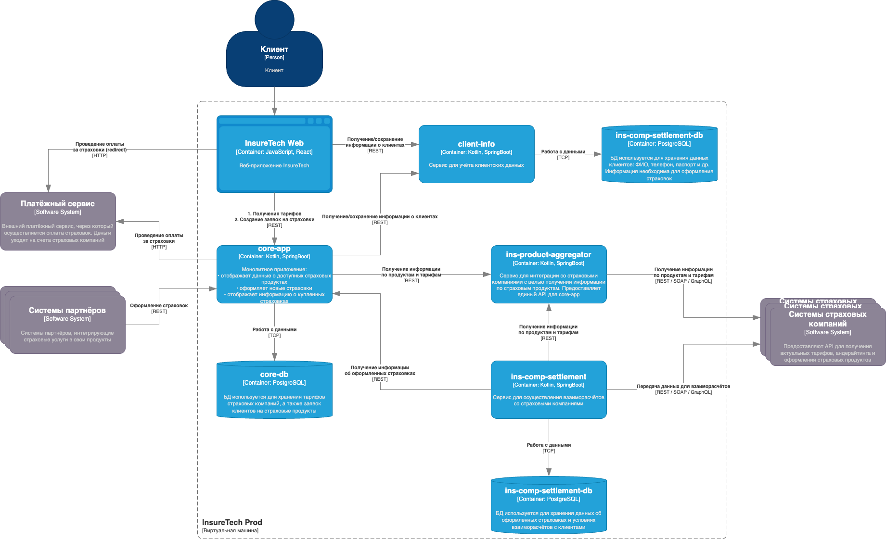

# Задание 4: Проектирование продажи ОСАГО

## Цель

Разработать архитектурное решение для онлайн-продажи ОСАГО с учётом требований бизнеса:
- Клиенту необходимо получить предложения от страховых компаний сразу по мере их поступления.
- Максимальное время ожидания ответа от страховой компании — 60 секунд.
- Пиковая нагрузка — до 2 500 одновременных пользователей.

---

## Архитектурные решения

### 1. Разделение ответственности

Для взаимодействия со страховыми компаниями выделяется отдельный сервис — **`osago-aggregator`**.

- `core-app` отвечает за приём пользовательской заявки и дальнейшее оформление полиса.
- `osago-aggregator` отвечает за:
  - Отправку заявки во все страховые компании.
  - Асинхронный сбор и агрегацию предложений.
  - Публикацию событий о новых предложениях, полученных от страховщиков.

---

### 2. Хранилище данных

Сервису `osago-aggregator` необходимо **собственное хранилище данных**, чтобы:
- Хранить статусы заявок и метаинформацию о взаимодействии с каждой страховой компанией.
- Использовать **паттерн Transactional Outbox** для гарантированной публикации событий в брокер сообщений (например, Kafka).
- Позволить повторные опросы и отложенную обработку без потери контекста.

---

### 3. API `osago-aggregator`

`sago-aggregator` предоставляет REST API для взаимодействия с `core-app`:

- `POST /osago/create`  
  Принимает данные заявки на оформление ОСАГО.  
  **Параметры запроса**: `userId`, информация о ТС, водителях и страхуемом периоде.

- `GET /osago/{requestId}/status`  
  Возвращает текущее состояние обработки заявки (полученные предложения, таймауты, ошибки и пр.).

---

### 4. Интеграция `core-app` ↔ `osago-aggregator`

Интеграция между `core-app` и `osago-aggregator` реализуется по следующей схеме:

- Инициирующий вызов: `core-app` отправляет REST-запрос на создание заявки в `osago-aggregator`.
- Обратная передача данных: `osago-aggregator` публикует события вида `OfferReceivedEvent` в брокер сообщений.
- `core-app` подписывается на эти события и сохраняет полученные предложения в своей БД для отображения пользователю.

Такой подход соответствует модели, использованной ранее для `ins-comp-settlement`, и обеспечивает:
- Отказоустойчивость,
- Масштабируемость,
- Немедленную реакцию на события.

---

### 5. API веб-приложения (интеграция UI ↔ `core-app`)

Для отображения предложений пользователю по мере их поступления используется **WebSocket-соединение** между фронтендом и `core-app`.

- После создания заявки пользователь подписывается по WebSocket на канал, связанный с его `requestId`.
- `core-app` по мере получения новых предложений от `osago-aggregator` отправляет их клиенту через WebSocket.
- Таким образом обеспечивается **реактивный пользовательский опыт**, без необходимости polling'а.

---

### 6. Применение паттернов отказоустойчивости

| Направление взаимодействия             | Паттерн                 | Обоснование |
|----------------------------------------|--------------------------|-------------|
| `core-app` → `osago-aggregator`        | **Rate Limiting**        | Защита от перегрузки в случае пикового трафика (2 500+ заявок). |
| `osago-aggregator` → страховые компании | **Circuit Breaker**      | Устойчивость к недоступности или нестабильной работе внешнего API. |
| `osago-aggregator` → страховые компании | **Retry + Timeout**      | Повтор при временных ошибках, с ограничением времени ожидания. |
| `core-app` → WebSocket (клиент)        | **Reconnect + Timeout**  | Гарантия восстановления соединения на фронте при разрыве. |

---

### 7. Масштабируемость и деплой

Все сервисы задеплоены в нескольких экземплярах. Принятые архитектурные решения **не зависят от количества инстансов**, так как:
- Публикация и обработка событий идёт через брокер сообщений (поддержка масштабирования по подписчикам).
- Вызовы REST балансируются стандартными средствами (например, через Kubernetes Ingress, API Gateway или Service Mesh).
- WebSocket соединения маршрутизируются через sticky-сессии или через stateful connection gateway.

---

## Результат

Данное архитектурное решение обеспечивает:
- Высокую отзывчивость пользовательского интерфейса,
- Надёжную доставку данных,
- Масштабируемость и отказоустойчивость при росте нагрузки,
- Чёткое разделение ответственности между сервисами,
- Лёгкость в дальнейшем расширении функционала (например, добавление новых страховых компаний).

